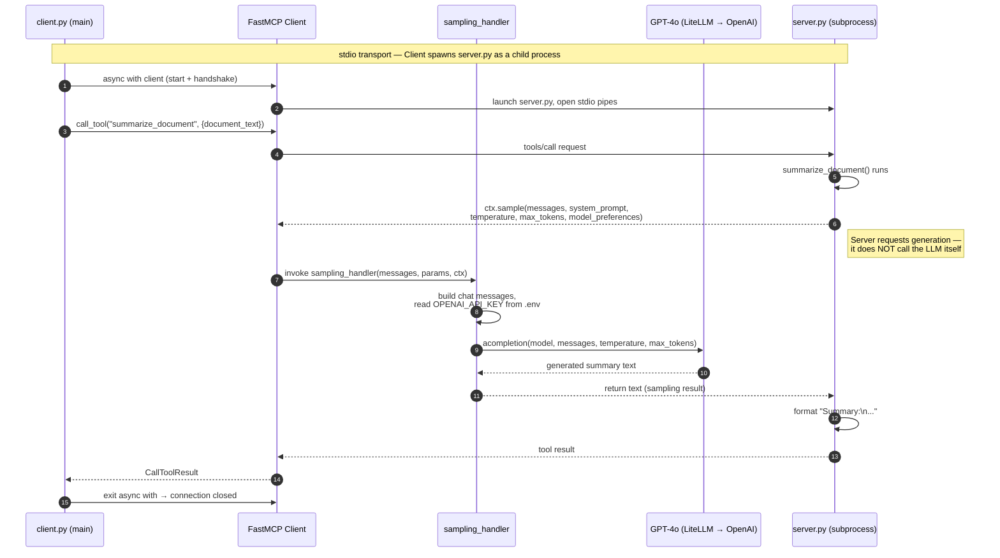
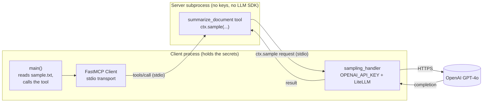

# Sampling in MCP — Demo

A minimal [FastMCP](https://github.com/jlowin/fastmcp) example that demonstrates **sampling**: the
mechanism by which an MCP **server** asks the **client** to run an LLM completion on its behalf,
instead of calling an LLM itself.

The server exposes a `summarize_document` tool. When called, the tool doesn't talk to any LLM
directly — it requests a completion from the client, which runs the model (GPT-4o via LiteLLM) and
returns the text.

## Sampling

The request direction is **inverted** from a normal tool call:

- The **server** holds no API keys and no model SDK. It just declares *what* it wants generated.
- The **client** owns the credentials, the model choice, and the LLM SDK. It decides *how* the
  generation actually happens (and can apply its own policy, fallbacks, cost controls, etc.).

This keeps secrets on the client side and lets a single server work with whatever model the client
is willing to provide.

## Flow



## Components



## Important parts of the code

| Where | What to notice |
|-------|----------------|
| [server.py:10-16](server.py#L10-L16) | `ctx.sample(...)` is the whole point — the server **requests** a completion (passing `system_prompt`, `temperature`, `max_tokens`, `model_preferences`) rather than calling an LLM. |
| [client.py:13-45](client.py#L13-L45) | `sampling_handler` is where the client fulfills that request: it builds chat messages, reads `OPENAI_API_KEY`, and calls the real model via LiteLLM. This is the client-side LLM policy. |
| [client.py:47](client.py#L47) | `Client("server.py", sampling_handler=...)` — passing a `.py` path selects the **stdio** transport, so the client spawns the server as a subprocess. No separate terminal needed. |
| [client.py:53-59](client.py#L53-L59) | `async with client:` manages the full lifecycle — start, handshake, and graceful shutdown. `is_connected()` is `False` afterwards by design. |
| [client.py:29](client.py#L29) | `modelPreferences.hints[0].name` — this implementation just takes the first hint. A real handler would validate/fallback across hints. |

## Setup

This project uses [uv](https://docs.astral.sh/uv/).

```bash
# 1. Install dependencies (creates .venv)
uv sync

# 2. Add your key — copy the template and fill it in
cp .env.example .env
#   then set OPENAI_API_KEY="sk-..." in .env

# 3. Run — the client launches the server automatically
uv run client.py
```

`open-me.ipynb` contains a guided, step-by-step walkthrough of the same setup.

## Expected output

```
[..] INFO  Starting MCP server 'Document Assistant' with transport 'stdio'
gpt-4o          # \
0.7             #  } printed by sampling_handler (model / temperature / max_tokens)
300             # /
CallToolResult(content=[TextContent(... text="Summary:\n...")], is_error=False)
Connected?: False   # connection closed when the `async with` block exits — expected
```

## Project layout

```
server.py        # FastMCP server — exposes summarize_document, uses ctx.sample()
client.py        # FastMCP client — runs the sampling_handler (the actual LLM call)
sample.txt       # input document fed to the tool
open-me.ipynb    # guided walkthrough notebook
.env.example     # template for OPENAI_API_KEY (copy to .env)
pyproject.toml   # uv project + dependencies (fastmcp, litellm, python-dotenv)
```
